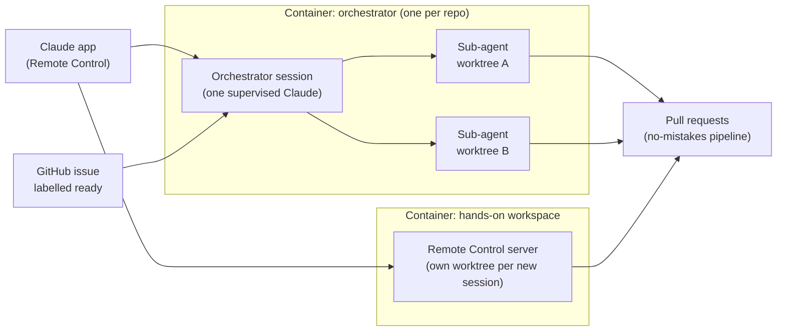

# dev-system

Run autonomous coding agents on any repo, from issue to merged pull request, with one shared,
versioned setup. It is for people who want to hand work to Claude Code (or codex) from a phone or
a browser and come back to a reviewed PR, without keeping a shell open on any machine.

## How it works

- **Every agent environment is its own container.** The same image runs as a desktop dev
  container, under `docker run`, on Kubernetes or as a Coder workspace. In an orchestrator
  container, tmux holds one Claude session and a supervisor restarts it when it exits.
  dev-system is not a tmux multiplexer running many terminals on one machine; you scale out
  by running more containers.
- **Two ways to give it work.**
  1. Talk to a persistent orchestrator session in the Claude app (via Remote Control). It stays
     alive across restarts, so you come back to it and dispatch work from anywhere.
  2. Label a GitHub issue `ready`. The orchestrator session watching the repo delegates design
     and implementation to sub-agents, which work in git worktrees and open PRs through the
     no-mistakes pipeline.
- **Sub-agents do the work inside the orchestrator's container.** Each issue goes to a sub-agent
  in its own worktree; the orchestrator does not start new containers.
- **You never need a shell on the host.** Logins, sessions and approvals happen from the Claude
  app or a link on your phone.

## Architecture

Three layers, each pinned independently:

- **Agent behaviour** - the `callum-flow` plugin in [`plugins/callum-flow/`](plugins/callum-flow/):
  the skills and hooks that turn issues into PRs.
- **Environment** - the base image in [`images/base/`](images/base/README.md): the tools, headless
  Claude with Remote Control, logins and persistent state.
- **Repo config** - [`templates/`](templates/README.md) synced into each repo by `callum-dev`, so
  a repo pins a version and pulls updates.



Containers are independent and sit side by side. See [`docs/architecture.md`](docs/architecture.md)
for the layers, versioning and the runtime map.

## Typical flows

**Dispatch from a phone**

1. Open the repo's orchestrator session in the Claude app.
2. Describe the work or point at an issue.
3. The orchestrator hands it to a sub-agent in a fresh worktree.
4. The pipeline reviews, tests and opens a PR; the orchestrator verifies and merges it,
   asking you when an owner decision is needed.

**Label an issue `ready`**

1. Write the issue and add the `ready` label.
2. The orchestrator session picks it up and delegates design and implementation to sub-agents.
3. The implementation sub-agent works in a worktree; the no-mistakes pipeline gates the change
   and opens a PR linked to the issue. The orchestrator then verifies and merges it.

## What's included

- **An environment that runs anywhere** - one image for desktop, `docker run`, Kubernetes and
  Coder ([`images/base/`](images/base/README.md)).
- **Agents you drive without a shell** - headless Claude with Remote Control, restarted when it
  exits ([`images/base/`](images/base/README.md)).
- **Logins from your phone** - missing logins start automatically and sign-in links reach you as
  a log line, login page or push notification ([`images/base/`](images/base/README.md)).
- **State that survives rebuilds** - logins and tool state live on `/persist` volumes
  ([runtime storage](images/base/README.md#how-runtimes-should-mount-it)).
- **An issue-to-PR workflow** - `issue-orchestrator`, `implement-issue`, `/update-dev` and
  `/callum-flow:onboard` (plugin in [`plugins/callum-flow/`](plugins/callum-flow/)).
- **Repo config that stays current** - `callum-dev init`, `update` and `check`
  ([`templates/`](templates/README.md)).
- **Coder workspaces** - including an orchestrator workspace that resumes across restarts
  ([Coder template reference](coder/dev-system/README.md#orchestrator-workspace)).
- **Central session history and telemetry** - optional session sync to one searchable
  viewer and OTLP export ([`images/base/`](images/base/README.md)).

## Start

New or existing repo: open an agent in the folder and tell it to follow
[`docs/onboarding.md`](docs/onboarding.md) ("make this a dev-system repo"), or, with the
`callum-flow` plugin installed, run `/callum-flow:onboard`.

By hand:

```bash
npm i -D github:cbundy/dev-system#semver:0.x
npx callum-dev init          # then fill every <REPLACE> and commit
```

## Docs

| Page | Read it for |
|---|---|
| [`docs/onboarding.md`](docs/onboarding.md) | Making a repo a dev-system repo (written for agents) |
| [`docs/architecture.md`](docs/architecture.md) | Layers, versioning, how updates reach repos, the runtime map for debugging |
| [`docs/metrics.md`](docs/metrics.md) | Factory metrics queries and the no-mistakes PostgreSQL mirror |
| [`images/base/README.md`](images/base/README.md) | The base image: persistence, `dev-init`, `dev-doctor`, Remote Control, logins, agentsview |
| [`coder/dev-system/README.md`](coder/dev-system/README.md) | The Coder templates: pushing them, parameters, OTLP |
| [`docs/developing-on-coder.md`](docs/developing-on-coder.md) | Developing dev-system itself from a Coder workspace: logins, and what only CI can verify |
| [`templates/README.md`](templates/README.md) | Each template file: what is synced and what the repo owns |
| [`RELEASING.md`](RELEASING.md) | Cutting a release of each layer |
